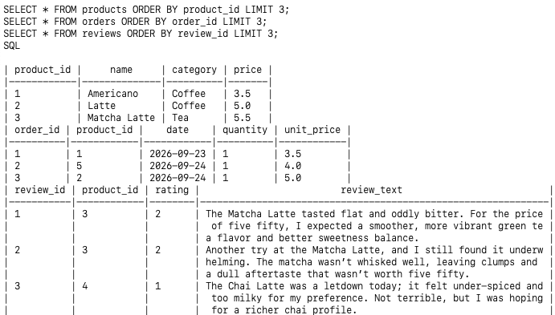
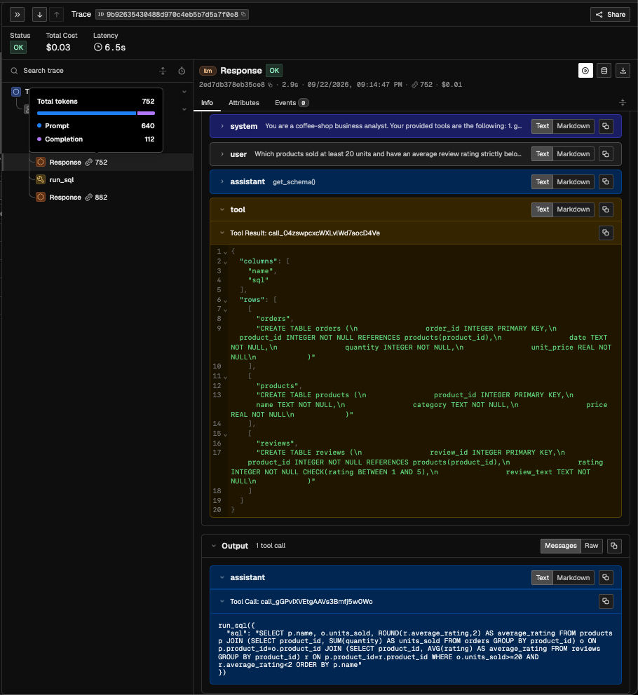
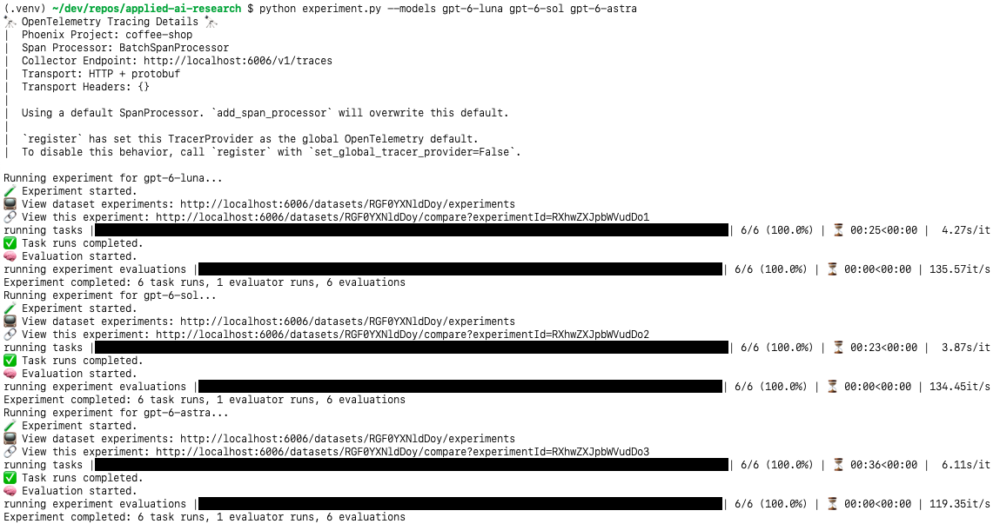
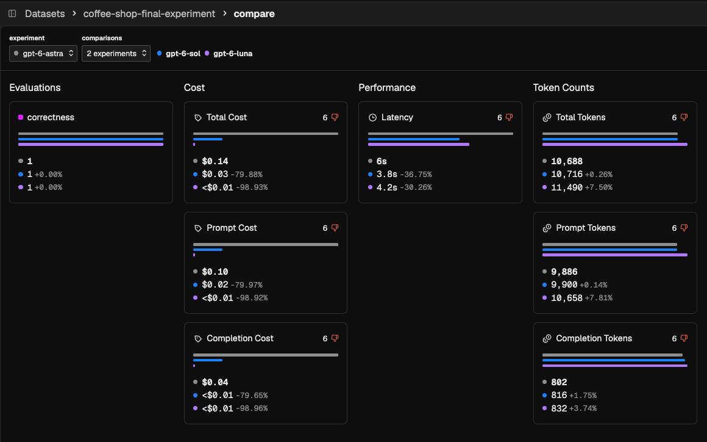

# Comparing GPT-6 Luna, Sol, and Astra with Phoenix

As of September 22nd, OpenAI has expanded their GPT-6 family, [launching Luna and Sol](https://openai.com/index/introducing-gpt-6-sol-and-luna/) alongside their flagship Astra model. These two new models provide many of the same advances as Astra at a cheaper price. 

With such an expansion comes "the freedom of choice", and therefore, many will wonder which of the three models are right for them. Limited public information, generalized launch benchmarks, and varying usage costs are some factors which can make that decision hard.

This problem illuminates Phoenix's value of allowing one to devise their own laboratory and compare models under their own specialized use case. **My project models this problem and demonstrates how Phoenix answers it.**

# Analyzing a coffee shop's sales to choose the right GPT-6 model

<p align="center"></p>

Consider a **coffee shop owner** who tends to use AI agents through OpenAI's API to analyze their sales data. They wish to know:

- **How do the newly released GPT-6 models (Luna, Sol) compare to Astra in terms of cost, correctness, latency, tool utilization, and token usage, under the specialized purpose of business analytics?**

## Table of Contents

I'll walk through how I approached this question, from designing the experiment to reflecting on the results.

- [1. Designing the experiment](#1-designing-the-experiment)
- [2. Agent's data](#2-agents-data)
- [3. Evaluation questions](#3-evaluation-questions)
- [4. File structure and setup](#4-file-structure-and-setup)
- [5. Phoenix](#5-phoenix)
- [6. Results](#6-results)
- [7. Reflection](#7-reflection)
- [8. Closure](#closure)

## 1. Designing the experiment

Let's begin! One of my first **challenges** was in decomposing this proposed research question into a measurable experiment. I began by asking:

***i. What are we comparing?***

The only independent variable in this experiment is the model itself (`gpt-6-luna`, `gpt-6-sol`, `gpt-6-astra`). For comparison's sake, all other variables (reasoning effort, prompt, available tools) remain the same.

***ii. What are we measuring?***: Cost, correctness, latency, tools, tokens.

| Category | Metric (as revealed by Phoenix) | 
| --- | --- |
| Cost | `costSummary.total.cost` |
| Correctness | `correctness` (evaluation will be discussed in more detail below) |
| Latency | `latency_ms` |
| Tools Used | `span_kind = "TOOL"` |
| Token Usage | `llm.token_count.prompt`, `llm.token_count.completion`, `llm.token_count.total` |

***iii. Where can we find accurate sales data to model a coffee shop?***

I spoke briefly with someone who worked at a coffee shop to understand a general problem space. Most datasets I found were quite dramatic in scope—either too specialized or too reduced. I wanted data rich enough for meaningful agentic work, yet simple enough to not detract from this demo's focus: showcasing Phoenix.

I decided to generate a small mock dataset containing 3 tables: `products`, `orders`, and `reviews`. This further provided a nice warmup in integrating OpenAI's API into the project (as I used `gpt-5-nano` to generate reviews with natural language). My data had some additional "flavor", as I made certain products favor certain review sentiments, certain products more popular, and varied daily demand to simulate busier/quieter days.

> [!NOTE]
> Details of the dataset will be described in the [2. Agent's data](#2-agents-data) section.

***iv. What should the agent be evaluated on, and what defines correctness?***

For evaluating correctness, **6 questions about sales data will be posed to the agent**. There will be 3 modes of difficulty (**easy, medium, hard**), with 2 questions asked per difficulty level, and the more difficult a question, the more reasoning I anticipate it will take. Responses will be compared to expected output to evaluate correctness.

> [!NOTE]
> Details about the evaluation questions will be explained in the [3. Evaluation questions](#3-evaluation-questions) section.

***v. What tools should the agents have?***

I figured it would be interesting to compare how efficient different models were with a limited set of tools, so I provided just two:

- `get_schema()`: return a schema of the SQLite table, including columns/relationships
- `run_sql(query)`: execute a read-only SQL query on the table and return columns/rows.

## 2. Agent's data

The dataset my agents will work with was generated by `helpers/build_dataset.py` and is stored in `store.sqlite` with the following schema:

| Table | Columns |
| --- | --- |
| `products` | `product_id`, `name`, `category`, `price` |
| `orders` | `order_id`, `product_id`, `date`, `quantity`, `unit_price` |
| `reviews` | `review_id`, `product_id`, `rating`, `review_text` |

> [!NOTE]
> Orders contain a `quantity`, but only of the same `product_id`: for example, a single order may contain a quantity of 5 croissants, but no other products.


Each `(product, category, price)` entry below summarizes each product's generated order counts, review counts, review sentiment bias (0 = negative, 1 = positive), and the observed average rating out of 5. 

```py
("Americano", "Coffee", 3.50),          # orders=13, reviews=4, bias=0.74, avg=3.50
("Latte", "Coffee", 5.00),              # orders=25, reviews=5, bias=0.16, avg=1.80
("Matcha Latte", "Tea", 5.50),          # orders=12, reviews=4, bias=0.30, avg=1.50
("Chai Latte", "Tea", 5.00),            # orders=21, reviews=4, bias=0.07, avg=1.00
("Croissant", "Pastries", 4.00),        # orders=18, reviews=4, bias=0.44, avg=3.25
("Blueberry Muffin", "Pastries", 3.50), # orders=11, reviews=4, bias=0.84, avg=4.00
```

**Some characteristics about our data:**
- The specific dataset I generated contains 6 products (listed above), 100 orders, and 25 reviews. 
- Lattes generate the most revenue and receive the most orders, despite a low average.
- Croissants lead in units sold.
- Blueberry muffins have the highest average rating, but the lowest revenue.
- Chai lattes receive the second-most orders, despite a low average.

**A small preview of our agent's data:** (`LIMIT 3`)



## 3. Evaluation questions

To simulate the demands of a business analyst's agentic workflow, I've defined **6 total questions**, with **2 questions per tier.**

***Questions are tiered roughly to this scale:***

| Tier | Examples |
| --- | --- |
| 🟢 Easy | basic SQL counts/sums
| 🟡 Medium | joins/groups/filtering
| 🔴 Hard | combining multiple aggregates with multiple conditions

***Evaluation questions:***


|# | Tier | Question | Expected |
| --- | --- | --- | --- |
| 1 | 🟢 | How many orders are recorded? | 100 |
| 2 | 🟢 | What is the total revenue? | $716.50 |
| 3 | 🟡 | For each category, report its order count, units sold, and revenue. Sort alphabetically by category. | Coffee: 38 orders, 57 units, $250.50; Pastries: 29 orders, 53 units, $204.50; Tea: 33 orders, 50 units, $261.50 |
| 4 | 🟡 | Which three products generated the most revenue? Return their names and revenue, ranked highest first. Break ties by lower product ID. | Latte: $170.00; Croissant: $152.00; Chai Latte: $135.00 |
| 5 | 🔴 | Which products sold at least 20 units and have an average rating strictly below 2? Report their names, units sold, and average ratings, ordered alphabetically by product name. | Chai Latte: 27 units, 1.00; Latte: 34 units, 1.80; Matcha Latte: 23 units, 1.50 |
| 6 | 🔴 | For each category, report total revenue and the percentage of all reviews in that category rated 1 or 2. Count each order and each review once, and sort alphabetically by category. | Coffee: $250.50, 55.56%; Pastries: $204.50, 0.00%; Tea: $261.50, 100.00% |

> [!NOTE]
> Questions with multiple components will be answered by agents in JSON format. Parsing logic can be found in `eval.py`.


## 4. File structure and setup

I kept the file structure modular to make it easy to reason about:

```sh
├── data
│   ├── questions.json   # 6 evaluation questions (question, expected)
│   └── store.sqlite     # sales dataset
│
├── helpers              
│   └── build_dataset.py # generates store.sqlite
│
├── agent.py             # run_agent(question, model) -> result
├── tools.py             # get_schema(), run_sql(sql)
├── database.py          # SQLite query execution
├── eval.py              # evaluate(result, expected)
│
├── experiment.py        # runs Phoenix experiments across models
├── tracing.py           # configures agent/tool tracing wrapper
│
└── pyproject.toml
```

**Quick setup** (macOS/Linux, from the repo root):

```sh
python3 -m venv .venv
source .venv/bin/activate
pip install openai python-dotenv arize-phoenix arize-phoenix-otel openinference-instrumentation-openai
```

Create a `.env` file with `OPENAI_API_KEY=your_api_key`. The dataset is already included.

Run `phoenix serve`, then in a second terminal from the repo root:

```sh
source .venv/bin/activate
python experiment.py --models gpt-6-luna gpt-6-sol gpt-6-astra
```

View the experiments at [localhost:6006](http://localhost:6006).

## 5. Phoenix

At this point, `agent.py` was able to answer questions with different OpenAI models and our dataset's tools, and `eval.py` was able to parse that model's answer and evaluate it for correctness. 

The exciting part: there was now a perfect application for both domains of Phoenix's offerings: observability and evaluation.

**Observability**

To add support for observability, I created `tracing.py` while referencing [Arize's Phoenix OTEL Reference](https://arize-phoenix.readthedocs.io/projects/otel/). Afterwards, I wrapped my agent with `@tracer.agent` and my tools with `@tracer.tool`. Continuing the [Phoenix repository's installation process](https://github.com/arize-ai/phoenix#run-locally), I ran `phoenix serve` to fire up the frontend. I also added Phoenix's [Remote MCP Server Endpoint](https://arize.com/docs/phoenix/integrations/remote-mcp#codex-openai) to my own coding agent.

I ran a small prompt, and Phoenix's frontend depicted a vast amount of detail for the inference, such as the entire tool call chain, latency, and cost. These traces provided everything I needed for the experiment, and implementing this layer was remarkably accessible. The volume and granularity of available information (such as seeing **Total tokens** for intermediate stages) was quite cool. I spent a fair amount of time just exploring the UI: 

<p align="center"></p>

**Evaluation**

Implementing Phoenix's evaluation into my project was likewise accessible and very valuable (as even writing a wrapper around `eval.py` to iterate through models and group experiments would have taken significant time).

I composed `experiment.py` by referencing Phoenix's API documentation for [experiments](https://arize-phoenix.readthedocs.io/projects/client/api/experiments.html) and [datasets](https://arize-phoenix.readthedocs.io/projects/client/api/datasets.html) with some help from the MCP, using `questions.json` as an experiment dataset. The output was elegant and succinct:



My `experiment.py` was able to define a dataset name and run, evaluate, and log experiments dynamically for each model that is passed in as a command-line argument:

```sh
# run experiments for all three gpt-6 models
python experiment.py --models gpt-6-luna gpt-6-sol gpt-6-astra

# or for each gpt-6 model, individually
python experiment.py --models gpt-6-luna
python experiment.py --models gpt-6-sol
python experiment.py --models gpt-6-astra

# or for other compatible OpenAI API models! 🙂
python experiment.py --models gpt-5.6-sol 
python experiment.py --models gpt-5-nano
```

## 6. Results

After running the three experiments for `gpt-6-luna`, `gpt-6-sol`, and `gpt-6-astra`, I was able to quickly sift through all of my findings, and the frontend's visualization made comparison exceptionally accessible.

The `coffee-shop-final-experiment` dataset contained the three experiments, and their comparisons are:



***Results:***

| Model | Cost | Correctness | Avg. Latency | Tool Calls | Prompt Tokens | Completion Tokens | Total Tokens |
| --- | ---: | ---: | ---: | ---: | ---: | ---: | ---: |
| `gpt-6-luna` | $0.0014818 | 1.00 (6/6) ✅ | 4,239.20 ms | 12 | 10,658 | 832 | 11,490 |
| `gpt-6-sol` | $0.0279600 | 1.00 (6/6) ✅ | 3,844.81 ms | 11 | 9,900 | 816 | 10,716 |
| `gpt-6-astra` | $0.1389600 | 1.00 (6/6) ✅ | 6,078.55 ms | 11 | 9,886 | 802 | 10,688 |

> [!NOTE]
> The metric name (as revealed by Phoenix) can be found in [1. Designing the experiment](#1-designing-the-experiment).

***For reference, [OpenAI API pricing](https://developers.openai.com/api/docs/pricing):***

| Model | Input | Cached Input | Cache Writes | Output |
| --- | ---: | ---: | ---: | ---: |
| `gpt-6-luna` | $0.10 | $0.01 | $0.125 | $0.50 |
| `gpt-6-sol` | $2.00 | $0.20 | $2.50 | $10.00 |
| `gpt-6-astra` | $10.00 | $1.00 | $12.50 | $50.00 |

> [!NOTE]
> USD per 1M tokens, Standard tier, short context


What stood out to me was how little this particular set of questions justified the extra spending, because each model was able to answer all 6 questions correctly.

**Luna's** total cost was roughly 94 times lower than **Astra's**, despite using slightly more tokens, which matches OpenAI's token usage cost for the GPT-6 family. Interestingly, **Sol** had the lowest average latency, though only about 0.4 seconds faster than **Luna**. 

For this coffee shop, **Luna** provides immense cost-saving value in performing the responsibilities demanded by this subset of questions for a much cheaper price. In future experiments, I'd like to spend more time designing trickier questions to really test each model's capabilities.

## 7. Reflection

***What did I learn from designing this experiment?***

- I learned how to spot a relevant topic, structure the problem space created by that topic, choose a pressing question from within that problem space which Phoenix can easily answer, and model that question practically as an experiment. 

***What did the results teach me?***

- It can often be deceptive how much reasoning (or lack thereof) is required for a task. I've observed in my own social circles that we tend to overestimate how much reasoning our tasks demand and consequently feel pressured to choose the most expensive model.
- As the results show, sometimes smaller models can effortlessly tackle the same tasks as larger models.
- Designing trickier questions would be insightful towards finding that "reasoning boundary" between different model suites.

***What did I learn about Phoenix, and what can another developer learn from it?***

- I learned that Phoenix *greatly* simplifies tasks which would otherwise be significantly demanding and that it's very accessible—and I'd like for developers to know about that. Because it's adaptable to one's subjective needs, it provides personalized insight that no launch benchmark can.

- Phoenix's tutorial documentation is simple and accessible. Therefore, implementing it into my project, along with its MCP server, was very streamlined. It's very easy to vouch honestly for just *how much* its services assist an ordinary developer.

- Something noteworthy: Luna and Sol had just come out the day *of*. The only compatibility step for me was importing the models' API costs into Phoenix. This adaptability makes the tool very powerful in this field, because change is so imminent.

***What are some challenges I faced, and how did I approach them?***

- **One challenge** I faced was in *transforming* a relevant topic (the release of GPT-6's new models) into a pressing question easily answerable by Phoenix. While reading about GPT-6's new models releasing, I knew this prompted significant questions for developers around the world. I wanted to choose the most general question that AI developers likely asked, transform that question into an experiment to fully depict its essence, and prove how effective Phoenix was at answering it.

- **Another challenge** I faced follows by extension to the previous challenge: seeding that general question with specificity, and modeling it accurately. I briefly chatted with someone who worked in the coffee industry and asked questions which allowed me to form "axes" around an analyst's problem space. I learned about the importance of product popularity and the unpredictableness of customer flow, which made modeling my agent's data more exciting and accurate. 

- **A third challenge** I faced was more general: tackling ambiguity. At the start of the day, Phoenix (as a tool), the new OpenAI models and what questions they create, and what a sales analyst looks for were all novel domains to me. By the end of the day, I felt confident using Phoenix as a tool to assist with my workflow and vouch for its effectiveness, while being able to compare GPT-6 models under the simulated environment of a coffee shop owner. Breaking tasks down into their core domains and tackling each independently allows me to reduce complexity significantly, greatly assisting me in learning new topics such as these.

# Closure

Thank you, **Arize**, for the opportunity to complete this project! It was very fun. :)
